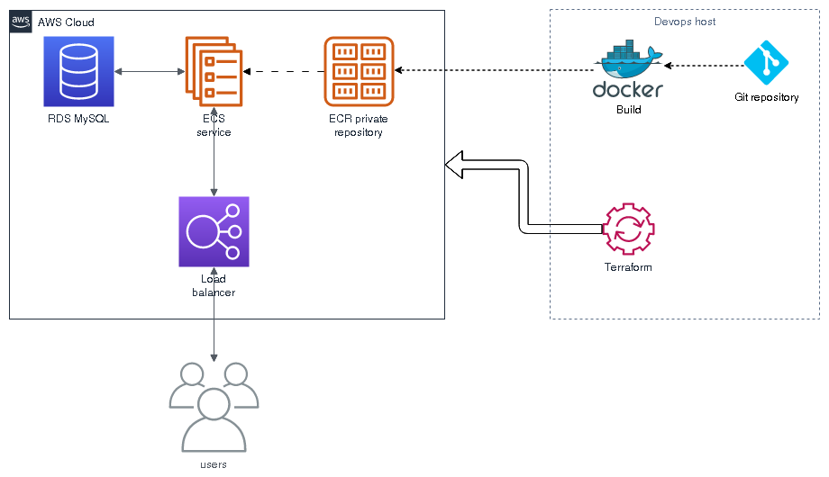

# README


### Requirements

* POSIX shell
* Docker with buildkit enabled
* AWS CLI
* Terraform
* curl


### Infrastructure setup

Solution diagram




#### Preliminary configuration

1. Setup AWS CLI
2. Setup AWS credentials for Terraform 
3. Choose and export the default AWS profile via environment variable AWS_DEFAULT_PROFILE you use several profiles


#### Setup and deploy infrastructure

Check the deployment settings in the 'terraform/terraform.tfvars'.

Install Terraform modules used in the deployment:

```
./ops setup
```

It runs `terraform init`, `terraform apply`, and saves output variables used by the deployment script.


#### Build and deploy the application

To build an image, test it, deploy, and wait for the ECS service to stbilize after the deployment,
run `ops` script with a 'deploy_wait' command and a git reference - tag, branch, or commit:

```
./ops deploy_wait v1.2

```

The script automatically builds and tests a Docker image locally before deployment.

Other commands:

```
./ops build v1.2
./ops test v1.2
./ops deploy v1.2
```


### Use the API

Get the API endpoint from Terraform output, register a user and check how soon is his birthday:

```
read API_ENDPOINT < terraform/.output_endpoint

curl -D - -X PUT -H 'content-type: application/json' -d '{"dateOfBirth": "2022-02-10" }' http://$API_ENDPOINT/hello/cv
curl -D - http://$API_ENDPOINT/hello/cv
```


## Wrap up

Setup the infrastructure, build a deploy the app, wait for it be ready, create the first user and check his birthdate:

```
export AWS_DEFAULT_PROFILE=hello_world

./ops setup
./ops deploy_wait v1.2

read API_ENDPOINT < terraform/.output_endpoint

curl -D - -X PUT -H 'content-type: application/json' -d '{"dateOfBirth": "2022-02-10" }' http://$API_ENDPOINT/hello/cv
curl -D - http://$API_ENDPOINT/hello/cv
```

It takes about 10 minutes.
